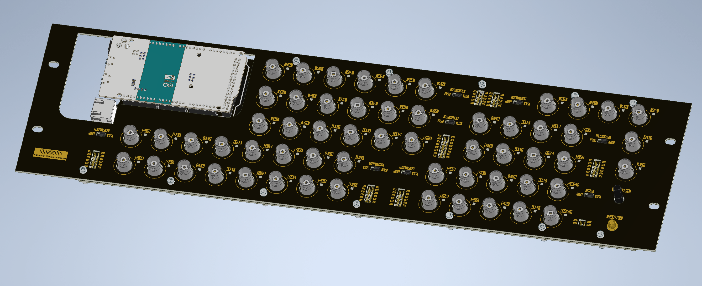
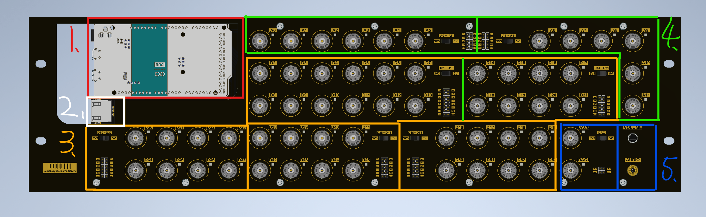

# Bpod Arduino Panel

A 58 I/O ports Bpod Module for neuroscience experiments.

> **Note:** To use this module with timing synchronisation, a Bpod state machine is required. Please refer to the [Bpod documentation](https://sanworks.github.io/Bpod_Wiki/) for more information.

The Bpod Arduino Panel is a Bpod expansion module powered by an Arduino Due. Equipped with 44 digital input/output ports, 12 analogue input ports, and 2 analogue output ports, it can drive various behavioural devices such as lights, speakers, valve drivers, and sensors. Each group of ports can be configured between 5V and 3.3V logic levels. This module is specifically designed for compatibility with the Bpod ecosystem, enabling users to synchronise timing when controlling large numbers of devices.

## 🔧 Features

- 44 digital input/output ports + 14 analogue ports (12 in, 2 out)
- Configurable logic levels (5V/3.3V)
- One 3.5mm audio output drives up to consumer line level (-10 dBV / 0.316 Vrms).
- 3U rack mountable panel

## 🌐 View Online (eCAD)

View the complete electronic design project online via [Altium 365 Viewer](https://sainsburywellcomecentre.github.io/fablabs-documentation/#Bpod-Arduino-Panel)

## 🚀 Getting Started

1. Connect the Bpod Arduino Panel to your computer via USB.
2. Open the Arduino IDE and select the appropriate board and port.
3. Upload the firmware to the Bpod Arduino Panel.
4. Connect the Bpod Arduino Panel to the Bpod state machine using an RJ45 cable.

## 🚀 I/O Port Layout

The following image provides an overview of the port layout and their respective functions.

1. Arduino Due Board
2. RJ45 Connector for Bpod communication
3. Digital I/O Ports (5 groups of 8/12, 44 total)
4. Analogue Input Ports (2 groups of 6, 12 total)
5. Analogue Output Ports (2 total) and Audio Output (3.5mm jack)

## ⚙️ Voltage Configuration

The max voltage levels for all the I/O are configured by the on-board switches. Each group can be configured between 3.3v and 5V. The ports on the module are grouped as follows:

- D2 to D13
- D14 to D21
- D30 to D37
- D38 to D45
- D46 to D53
- A0 to A5
- A6 to A11
- DAC0 and DAC1

## ⚙️ Firmware and Protocol

The firmware development is based on the Arduino platform, reference from the [Bpod shield](https://github.com/sanworks/Bpod_Gen2/tree/master/Examples/Firmware/Bpod%20Shield) firmware.

The operation code (opcode in Bpod Language) of the device is varied according to the firmware. The functionality of each port has to be pre-defined in the firmware. Please refer to the [opcode table](firmware/OPCODE_TABLE.md) for detailed information on available opcodes and their usage.

## 💻 Software Requirements

- **Altium Designer 24** or newer  
  Academic licenses available via [Altium Education](https://www.altium.com/education/)

- **Autodesk Inventor Pro 2025** or newer  
  Academic licenses via [Autodesk Education](https://www.autodesk.com/education/home)

- **Arduino IDE** (Download from [Arduino Software](https://www.arduino.cc/en/software))

## 📜 License

**Sainsbury Wellcome Centre hardware is released under** [Creative Commons Attribution-ShareAlike 4.0 International](http://creativecommons.org/licenses/by-sa/4.0/).

You are free to:

- **Share** — copy and redistribute the material in any medium or format
- **Adapt** — remix, transform, and build upon the material for any purpose

Under the following terms:

- **Attribution** — Give appropriate credit, link to the license, and indicate changes.
- **ShareAlike** — Distribute your contributions under the same license.
- **No additional restrictions** — Don’t apply legal or technological measures that prevent others from doing anything the license permits.

> For the full legal text, see [LICENSE](LICENSE).

## 💻 TODO

- [ ] Add Python program for standalone operation
- [ ] Add firmware upload instructions
- [ ] Add audio playback firmware example

## 📚 Credits

- **Bpod Shield**: [Sanworks LLC](https://sanworks.github.io/Bpod_Wiki/)
- **Protocol**: [ArCOM](https://github.com/sanworks/ArCOM)

## 🤝 Contributing

1. Fork the repository
2. Create a feature branch
3. Make your changes
4. Submit a pull request

## ❤ Contributors

 

## 📧 Contact

- **Author**: [@DCisHurt](https://github.com/DCisHurt)
- **Email**: [yuhsuan.chen@ucl.ac.uk](mailto:yuhsuan.chen@ucl.ac.uk)
- **Website**: [FabLabs](https://sainsburywellcomecentre.github.io/fablabs-documentation/#Bpod-Arduino-Panel)

